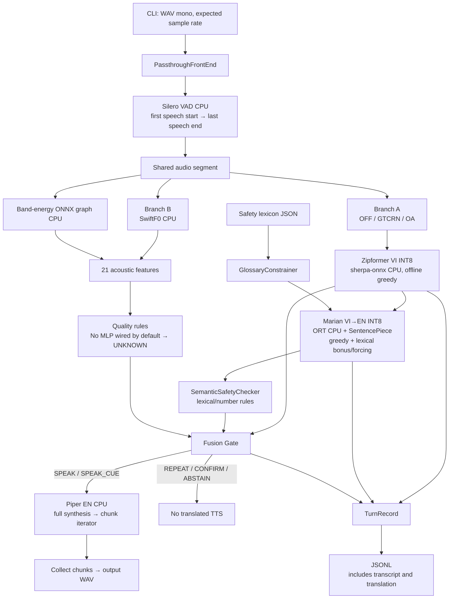

# 1. Executive Summary

**ToneBridge hiện là một research PoC chạy theo utterance trên laptop, có pipeline VI→EN, safety rules, acoustic feature extraction và hệ thống thí nghiệm tương đối tốt. Chưa đủ bằng chứng để gọi đây là Android MVP, hệ thống dịch hai chiều, hay bộ phiên dịch y khoa có độ tin cậy đã được xác nhận.**

Điểm mạnh đáng giữ là cách chia module, tách Branch B khỏi denoised audio, có các hành động `REPEAT / CONFIRM / ABSTAIN`, và sẵn sàng bác bỏ giả thuyết kỹ thuật khi benchmark không ủng hộ. Quyết định giữ denoising mặc định `OFF` là một ví dụ tốt.

Điểm yếu lớn nhất là **khoảng cách giữa “các từ quan trọng xuất hiện trong bản dịch” và “quan hệ y khoa được bảo toàn”**. Tôi đã tái hiện bằng checker/gate hiện tại các trường hợp sai vẫn nhận `SPEAK`:

- Đảo liều giữa hai thuốc.
- Đảo phạm vi phủ định giữa hai mệnh đề.
- Thêm thuốc không có trong nguồn.
- Đổi `0,5 miligam` thành `5 milligrams`.
- Sai tần suất dùng thuốc.
- Chuyển “có thể dị ứng” thành “dị ứng”.
- Chuyển yêu cầu ngừng thuốc thành tiếp tục thuốc.

Đây là **phản ví dụ đưa trực tiếp vào checker/gate**, không phải kết quả suy luận NMT mới hay ước lượng tần suất lỗi thực tế.

Một vấn đề độc lập nhưng cùng mức quan trọng: safety checker chỉ nhìn **ASR text → translated text**. Nếu ASR nghe sai nhưng NMT dịch đúng câu nghe sai đó, checker có thể hoàn toàn đồng ý. Output lưu trong repository cho thấy ASR confidence hiện không phát hiện tốt transcript sai dưới babble noise.

**Nếu chỉ triển khai một cải tiến:** nâng safety gate từ kiểm tra sự hiện diện của từ khóa sang kiểm tra **clinical relations có phạm vi rõ ràng**, đồng thời yêu cầu xác nhận khi không phân tích được thuốc/liều/phủ định. Đây là cải tiến có bằng chứng trực tiếp, không cần model mới, phù hợp Edge AI và dễ xây dựng acceptance tests.

**Hướng nghiên cứu đáng theo đuổi:** *selective medical speech translation* — kết hợp chất lượng bằng chứng ASR, tính nhất quán của clinical relations và acoustic quality để tối ưu **unsafe output rate ở một mức coverage xác định**.

**Phạm vi xác minh ngày 08/10/2026:**

| Hoạt động | Kết quả |
|---|---|
| Khảo sát source/config/test/tools/report hiện có | Đã thực hiện |
| Parse cú pháp toàn bộ 74 file Python | Không phát hiện syntax error |
| Chạy nhóm test logic khả dụng | **55 passed**, 1 test dữ liệu thực bị loại khỏi lượt chạy |
| Tái tính safety từ NMT output lưu sẵn | Khớp hoàn toàn file post-hoc |
| Kiểm tra WER từ error counts lưu sẵn | Khớp các WER đã lưu sau làm tròn |
| Chạy lại ASR/NMT/TTS thật | **Không thực hiện được**: thiếu assets/dependency |
| Đo Android/Snapdragon/NPU/energy | **Chưa xác minh** |
| Thay đổi repository, cài dependency, tải model, commit/push | **Không thực hiện** |

---

# 2. Product Overview & Current Capabilities

## 2.1. Sản phẩm giải quyết vấn đề gì?

Theo [Technical Proposal v3.1](D:/bachkhoa/OneVoice/ToneBridge_TechProposal_v3_1_Revised_Template.docx), ToneBridge hướng tới giao tiếp y tế ngắn giữa:

- Nhân viên y tế Việt Nam và bệnh nhân/người nhà nói tiếng Hàn.
- Người Việt và người nói tiếng Anh.
- Nhân viên hoặc học viên nước ngoài trong giao tiếp hỗ trợ chuyên môn.

Giá trị sản phẩm dự kiến gồm:

1. Xử lý cục bộ khi mạng không sẵn có hoặc không phù hợp.
2. Bảo toàn thuốc, liều, đơn vị, phủ định, dị ứng và triệu chứng quan trọng.
3. Cung cấp tín hiệu **vocal urgency** riêng.
4. Biết yêu cầu nói lại, xác nhận hoặc từ chối đầu ra.

Phạm vi phù hợp là **communication aid và clinical decision-support dưới sự giám sát**, không phải chẩn đoán, tự động triage hay đề xuất điều trị.

## 2.2. Khác biệt thực sự so với speech translation thông thường

Điểm khác biệt có cơ sở trong code là:

- Có safety checker sau NMT.
- Có selective gate với năm hành động.
- Có acoustic branch độc lập với denoising của Branch A.
- Có experimental harness cho noise, glossary constraints và safety failures.

**Chưa chứng minh được** các khác biệt quảng bá trong README:

- Prosody-transfer TTS.
- Hands-free/Zero-UI thực tế.
- Snapdragon NPU inference.
- Dịch hai chiều.
- Urgency classification có hiệu quả trên người nói thật.

Không có đánh giá đối thủ trong repository đủ để kết luận ToneBridge tốt hơn các ứng dụng thương mại về accuracy, noise robustness hay latency.

## 2.3. MVP và mở rộng

| Phạm vi | Proposal v3.1 | Implementation hiện có |
|---|---|---|
| Challenge MVP | Android phone, VI↔KO và VI↔EN, PTT, safety gate, vocal urgency | Python CLI, file WAV, VI→EN |
| Productisation | Asset/license freeze, bilingual/clinical review, QCS6490 | Có inventory và ghi nhận license risks; chưa deployment |
| Future | Wearable/low-UI, thêm ngôn ngữ/workflow | Chỉ ở tài liệu |

**VI→EN một chiều chỉ hỗ trợ một phần nhỏ workflow giao tiếp hai chiều.** Đây là thay đổi về product coverage, không chỉ là tối ưu kỹ thuật.

## 2.4. Các yêu cầu quan trọng nhất

**Functional:** capture/endpointing, ASR, NMT, safety check, output gating, TTS, advisory urgency, confirmation/recovery.

**Non-functional:** offline verification, latency sau endpoint, RAM, thermal/energy, reproducibility, privacy, deployment compatibility và giới hạn sử dụng rõ ràng.

Proposal §4.5 thực tế có các target:

- WER ≤15/20/25/35% ở clean/10/5/0 dB.
- Medical-term preservation ≥95%.
- Negation và dosage/unit preservation mục tiêu ≥99%.
- Urgency Macro-F1 ≥0,80 và HIGH recall ≥0,90 đến 5 dB.
- E2E p50 ≤1,5 s; p95 <2,0 s trên ≥100 utterances.

Điều này **mâu thuẫn với câu “No numeric target in the Proposal text”** cho M2 trong [OVERNIGHT_SUMMARY.md](D:/bachkhoa/OneVoice/OneVoice/Prototype/reports/OVERNIGHT_SUMMARY.md). Ngưỡng dừng vòng tối ưu 70% không thay thế các target của Proposal.

---

# 3. Repository & Architecture Map

## 3.1. Phạm vi repository thực tế

Code hiện hành nằm trong:

`D:\bachkhoa\OneVoice\OneVoice\Prototype`

| Vị trí | Nội dung |
|---|---|
| [README.md](D:/bachkhoa/OneVoice/OneVoice/README.md) | Pitch/architecture đời đầu, nhiều tuyên bố đã lỗi thời |
| [PROGRESS.md](D:/bachkhoa/OneVoice/OneVoice/Prototype/PROGRESS.md) | Lịch sử quyết định, measurements và scope changes |
| `src/tonebridge/` | 32 file Python, 2.214 dòng |
| `tests/` | 13 file Python, 831 dòng |
| `tools/` | 29 file Python, 1.685 dòng; thêm shell scripts |
| `configs/` | Runtime configuration, glossary, safety lexicon, splits |
| `results/`, `logs/`, `reports/` | Output thí nghiệm và diễn giải |
| `recording_kit/` | Script thu âm, metadata và consent |
| `golden/` | Acoustic feature vectors phục vụ equivalence |

**Không có trong working tree hiện tại:**

- Thư mục `onevoice/` chứa PRD/Technical Requirements/Product Flow/Backend Architecture/Implementation Plan như yêu cầu đề cập.
- Thư mục `paper research/`.
- `models/` và `data/`.
- Android project/app.
- `tools/aihub_submit.py`, dù được nhắc trong PROGRESS.
- `reports/LAPTOP_RESULTS.md`, dù được tham chiếu trong OFFLINE_FILES.

Tôi sử dụng Proposal v3.1, ADR và tài liệu còn tồn tại; không suy diễn nội dung các tài liệu thiếu.

Workspace ngoài cùng có các file legacy đã bị xóa từ trước lượt audit. Tôi không khôi phục hoặc coi chúng là implementation hiện hành. Nested repository `OneVoice/` vẫn sạch sau kiểm tra.

## 3.2. Sơ đồ kiến trúc từ implementation



Bằng chứng điều phối: `Pipeline._branch_a`, `_branch_b`, `run` trong [pipeline.py:49](D:/bachkhoa/OneVoice/OneVoice/Prototype/src/tonebridge/pipeline.py:49).

**Lưu ý:** `SPEAK_CUE` hiện là trạng thái dữ liệu. Pipeline không có sink phát LED, haptic hay âm báo urgency riêng.

---

# 4. Detailed Pipeline Analysis

## 4.1. Audio input, preprocessing và VAD

**Implementation**

- CLI đọc WAV, kiểm tra sample rate.
- Chuyển PCM16 sang float32.
- Stereo được lấy trung bình.
- Front-end mặc định passthrough.
- Silero tìm các speech spans rồi trả một khoảng từ speech đầu đến speech cuối, có padding.

Bằng chứng: `load_wav` tại [cli.py:23](D:/bachkhoa/OneVoice/OneVoice/Prototype/src/tonebridge/cli.py:23); `SileroVad.segment/segments` tại [vad_silero.py:23](D:/bachkhoa/OneVoice/OneVoice/Prototype/src/tonebridge/stages/vad_silero.py:23).

**Điểm mạnh:** không âm thầm resample trong CLI; hai branch dùng cùng segment.

**Hạn chế:**

- Không có microphone capture, PTT controller hay playback thực.
- PCM integer khác `int16` không được scale đúng.
- Không kiểm tra NaN/Inf, biên độ, shape hay clipping.
- `max_utterance_s=15` được khai báo nhưng không thực thi trong `Pipeline.run`.
- VAD chỉ nhận các block đủ 512 samples; phần dư cuối bị bỏ qua trước `flush`, tối đa gần 32 ms.
- Không có preflight “no speech” để dừng trước ASR/NMT; segment rỗng vẫn được gửi vào Branch A.
- VAD chưa phân biệt target speaker với người nói nền.

**Khả năng mở rộng:** giữ interface hiện tại, bổ sung validation và endpoint metadata trước khi tích hợp Android capture.

## 4.2. Denoising

Các arm thực có:

- `OFF`: passthrough.
- `ON`: GTCRN qua sherpa-onnx.
- `OA`: `β·enhanced + (1−β)·noisy`.
- Classical minimum-statistics/Wiener-style NS trong tools thí nghiệm.

Bằng chứng: [denoise.py:12](D:/bachkhoa/OneVoice/OneVoice/Prototype/src/tonebridge/stages/denoise.py:12), [denoise_classic.py:8](D:/bachkhoa/OneVoice/OneVoice/Prototype/src/tonebridge/stages/denoise_classic.py:8).

**Quyết định hợp lý hiện tại:** giữ `OFF`. [ADR-001](D:/bachkhoa/OneVoice/OneVoice/Prototype/docs/ADR-001-denoise.md) ghi không arm nào cải thiện ≥2 điểm WER trong 13 dev cells; GTCRN ON thường làm tệ hơn.

**Giới hạn kết luận:**

- Đây là FLEURS + DEMAND/synthetic babble/alarm, chưa phải hospital recordings.
- Trimming/padding bảo đảm chiều dài, không tự bảo đảm sample alignment cho mọi model/version.
- Không có bằng chứng rằng “aggressive denoise cứu accuracy” như README mô tả.

## 4.3. ASR

**Thực tế:** offline Zipformer transducer tiếng Việt qua sherpa-onnx, greedy search, CPU, thường 2 threads. Factory chọn decoder INT8.

`SherpaZipformerVi.transcribe` trả text lowercase và:

\[
confidence = \exp\left(\operatorname{mean}(\text{token log probabilities})\right)
\]

Bằng chứng: [asr_sherpa.py:16](D:/bachkhoa/OneVoice/OneVoice/Prototype/src/tonebridge/stages/asr_sherpa.py:16).

**Điểm mạnh:** adapter nhỏ, model/runtime tách khỏi orchestration; INT8 shipping choice được ghi nhận.

**Hạn chế quan trọng:**

- Token confidence không phải xác suất transcript hoặc clinical slots đúng.
- Không có token-level confidence trong contract.
- Không có timestamp/alignment/n-best evidence truyền xuống gate.
- Không có speaker attribution.
- Không có dysarthria tuning hoặc benchmark dysarthric speech hiện hành.
- Không phải streaming ASR.

Output lưu sẵn tại [asr_conf_gate_check_dev.json](D:/bachkhoa/OneVoice/OneVoice/Prototype/results/asr_conf_gate_check_dev.json) cho thấy ở babble 0 dB:

- 161/200 utterances có WER >30%.
- Mean confidence: sai `0,791`, tốt `0,835`.
- Ngưỡng `0,5` bắt **0%** bad utterances trong phép kiểm tra này.

Đây là bằng chứng chống lại việc dùng ngưỡng hiện tại như noisy-speech safety guarantee.

## 4.4. NMT

**Thực tế:** `Helsinki-NLP/opus-mt-vi-en`, Marian encoder-decoder, dynamic INT8, CPU ORT; SentencePiece và vòng decode NumPy tự viết.

Bằng chứng: `OrtMarianNmt` tại [nmt_ort.py:21](D:/bachkhoa/OneVoice/OneVoice/Prototype/src/tonebridge/stages/nmt_ort.py:21).

**Input/output:** VI text → EN text và `hops=["vi>en"]`. Không trả confidence, termination reason, constraint coverage hay truncation status.

**Điểm mạnh:**

- Inference không cần torch/transformers.
- Có KV cache; cross-attention cache được giữ sau step đầu.
- Có greedy/beam để làm ablation.
- Không cần model lớn hơn để thử cải thiện decoding.

**Hạn chế:**

- Giới hạn 48 generated tokens nhưng không báo khi chạm giới hạn.
- Source length không được kiểm soát.
- Constraints có thể cưỡng ép từ mà không giữ đúng quan hệ.
- Nếu bật constrainer, `translate` đi vào greedy kể cả khi `num_beams>1`.
- Runtime CPU được hardcode; chưa có provider selection.

Chi tiết correctness ở mục 9.

## 4.5. Clinical safety

`SemanticSafetyChecker` kiểm tra:

- Có negation cue nguồn thì yêu cầu một negation form ở đích.
- Có thuốc/allergen nguồn thì yêu cầu accepted target form.
- Có số đứng ngay trước đơn vị thì yêu cầu đơn vị và số đó xuất hiện ở đích.
- Thiếu intensity thì `confirm=True`.

Bằng chứng: [safety.py:120](D:/bachkhoa/OneVoice/OneVoice/Prototype/src/tonebridge/safety.py:120).

**Điểm mạnh:** deterministic, dễ giải thích, offline, chi phí thấp; có thể chặn một số lỗi omission đơn giản.

**Giới hạn bản chất:** đây là **lexical preservation checker**, chưa phải reliable semantic consistency checker. Nó thiếu:

- Negation scope.
- Drug–dose association.
- Frequency, route, duration.
- Experiencer và temporality.
- Uncertainty/modality.
- Symptom preservation.
- Kiểm tra entity bị thêm vào đích.
- OOV/unsupported-construction abstention.

## 4.6. TTS

**Thực tế:** Piper `en_US-ljspeech-medium` qua sherpa-onnx CPU.

`stream()` gọi `synth(text)` tạo toàn bộ audio rồi mới yield chunks. `speed=1.0`, `sid=0`.

Bằng chứng: [tts_piper.py:38](D:/bachkhoa/OneVoice/OneVoice/Prototype/src/tonebridge/stages/tts_piper.py:38).

**Chưa có prosody transfer:** interface chỉ nhận text/lang; Branch B chỉ truyền urgency result đến gate, không truyền F0/energy/rhythm vào TTS.

**Điểm mạnh:** local synthesis, output sample rate lấy từ engine.

**Hạn chế:**

- Chunk iterator không tạo incremental synthesis.
- CLI còn đợi hết chunks rồi mới ghi WAV; chưa có streaming playback.
- `synth_first_clause` đã có nhưng chưa được pipeline dùng.
- Chưa có đánh giá phát âm tên thuốc, số thập phân, acronym.
- Voice-data license và phonemizer/runtime license cần được phân biệt.

## 4.7. Branch B: pitch, features và urgency

**Thực tế:**

- SwiftF0 cung cấp pitch/confidence/loudness.
- Một ONNX graph dùng Conv với DFT kernel tính band energies.
- NumPy tổng hợp 21 features.
- F0 thống kê theo semitone so với median của chính utterance.
- Quality rules trả `UNKNOWN`.
- Factory không cung cấp MLP → urgency không thể trở thành LOW/HIGH từ model mặc định.

Bằng chứng: [branch_b.py:65](D:/bachkhoa/OneVoice/OneVoice/Prototype/src/tonebridge/branch_b.py:65), [branch_b.py:165](D:/bachkhoa/OneVoice/OneVoice/Prototype/src/tonebridge/branch_b.py:165), [factory.py:37](D:/bachkhoa/OneVoice/OneVoice/Prototype/src/tonebridge/stages/factory.py:37).

**Điểm mạnh:** kiểm tra DSP equivalence có ý nghĩa; UNKNOWN reasons được tường minh.

**Hạn chế:**

- Monophonic pitch confidence không xác nhận đó là giọng target speaker.
- Voiced fraction có thể tăng vì người nói nền.
- Median normalization loại thông tin register tăng trên toàn utterance; đây là trade-off cần ablation.
- Loudness phụ thuộc khoảng cách mic, gain và thiết bị.
- Chưa có syllable/speech-rate estimator; voiced-run rate không tương đương speaking rate.
- `provenance` là tham số chuỗi do caller cung cấp, không phải thuộc tính được bảo vệ của audio buffer.
- `compute_features` không kiểm tra F0 dương/finite trước `log2`.

Code training có LOSO và train-only standardizer, nhưng đánh giá hiện chỉ chọn clean held-out rows, threshold `0,5`; runtime dùng `0,7` và UNKNOWN rules. Vì vậy **training evaluation chưa đại diện inference policy**. Xem [urgency_train.py:90](D:/bachkhoa/OneVoice/OneVoice/Prototype/src/tonebridge/urgency_train.py:90).

## 4.8. Integration, parallelism và fallback

Thứ tự thực:

1. Front-end → VAD.
2. Fan-out:
   - A: denoise → ASR → NMT → safety.
   - B: acoustic analysis.
3. Join cả hai.
4. Gate.
5. TTS nếu được duyệt.

Có `ThreadPoolExecutor(max_workers=2)` cho hai branch, nhưng không có:

- Timeout/watchdog.
- Recovery state khi model exception.
- Model-load failure handling.
- Fallback provider được thử và xác nhận.
- Confirmation transaction để người dùng sửa/xác nhận rồi tiếp tục.
- Output cue implementation.

Factory tạo sessions một lần khi xây stages; chưa có cache manager, lifecycle policy hay direction-gated loading. Mỗi turn tạo thread pool mới.

**Offline:** inference adapters mở local assets và dùng CPU runtime. Tuy nhiên `OfflineGuard` chỉ chặn Python socket calls, sampling native connections có khoảng trống, và không hoạt động mặc định. Nó là công cụ kiểm chứng hữu ích, chưa phải network isolation guarantee.

---

# 5. Implementation Status vs Requirements

“Đã triển khai” dưới đây nghĩa là **code path tồn tại**; model inference hiện không được chạy lại trong môi trường audit.

| Feature | Trạng thái | Bằng chứng | Mức hoàn thiện |
|---|---|---|---|
| WAV→ASR→NMT→gate→WAV VI→EN | Đã triển khai | `Pipeline.run`, [pipeline.py:64](D:/bachkhoa/OneVoice/OneVoice/Prototype/src/tonebridge/pipeline.py:64); saved smoke | Research path |
| VI↔EN | Một phần | VI→EN assertions trong NMT/factory | Thiếu EN→VI |
| VI↔KO | Chỉ khảo sát/model bake-off | [ADR-002](D:/bachkhoa/OneVoice/OneVoice/Prototype/docs/ADR-002-nmt-direction.md) | Không có active pipeline |
| PTT/microphone/Android audio | Chỉ trong tài liệu | CLI nhận file | Chưa triển khai |
| Zero-UI/hands-free | Chỉ trong README | Không capture/session controller | Chưa triển khai |
| Silero VAD | Đã triển khai | `SileroVad` | Chưa clinical/noisy endpoint validation |
| GTCRN/OA/classical NS | Đã triển khai/thí nghiệm | Denoise modules, ADR-001 | Default OFF có cơ sở |
| ASR noise robustness | Một phần | Noise grids | Babble failures nghiêm trọng |
| Medical constrained decoding | Đã triển khai | `GlossaryConstrainer`, greedy | Heuristic, không guarantee |
| Negation/drug/dose/allergy checks | Một phần | `check_texts` | Kiểm tra từ khóa, thiếu relations |
| Critical symptom safety | Chỉ một phần ở gold data | `symptom` có trong contract/generator nhưng checker không kiểm | Thiếu runtime behavior |
| OOV clinical term→CONFIRM | Chỉ trong Proposal | Không thấy OOV gate | Chưa triển khai |
| Năm gate actions | Đã triển khai | `decide`, [gate.py:42](D:/bachkhoa/OneVoice/OneVoice/Prototype/src/tonebridge/gate.py:42) | Logic có test; recovery thiếu |
| SwiftF0 + acoustic features | Đã triển khai | Branch B/graph | Numerical path, chưa urgency validity |
| Urgency MLP | Một phần | Training/export code | Không trained artifact/loader wiring |
| UNKNOWN handling | Đã triển khai | `unknown_reasons`, `analyze` | Threshold chưa tuned |
| Prosody-transfer TTS | Chỉ README; đã declared dropped | TTS không nhận prosody | Không có |
| Urgency cue đến nhân viên | Một phần | `SPEAK_CUE` enum | Không có output sink |
| Offline verification | Một phần | Guard/tests/manifest | Không có model assets để audit lại |
| Android/Snapdragon inference | Chỉ tooling chuẩn bị | Device scripts | Chưa có device measurements |
| QNN/NPU/AI Hub | Chỉ target/tài liệu | CPU providers hardcoded | Chưa chứng minh |
| Metadata-only logging | Không khớp implementation | `TurnRecord.asr_text/nmt_text` | Content được log |
| Dashboard/hash-chain/mesh | Chỉ README; declared dropped | DEVIATIONS | Không có |
| License/version freeze | Một phần | Inventory có hashes, config còn `unpinned` | Chưa release-ready |

Các mâu thuẫn đáng chú ý:

- README: Whisper-small/NAFNet/NPU/prosody transfer; code: Zipformer/GTCRN CPU/neutral Piper.
- README đánh dấu PoC Snapdragon hoàn tất; tài liệu mới chỉ laptop-first.
- README Getting Started trỏ tới cấu trúc/lệnh không tồn tại.
- `PROGRESS.md` còn ghi ADR-002 “Proposed”; ADR hiện ghi “Accepted”.
- “0 stubs” không có nghĩa urgency classification hoàn chỉnh: factory vẫn không có MLP.
- Pipeline config ghi voicing threshold `0,5`; gate/Branch B dùng config riêng với `0,7`.
- Vai trò `spk04` không được gắn NMT/Safety/TTS trong README hiện có. [Recording guide:9](D:/bachkhoa/OneVoice/OneVoice/Prototype/recording_kit/HUONG_DAN_THU_AM.md:9) gắn `spk04` với Thịnh; Proposal §7.1 gắn Thịnh với ASR. Tôi vẫn phân tích NMT/Safety/TTS theo trọng tâm bạn yêu cầu.

---

# 6. Code Quality, Bugs & Risks

## 6.1. Các phản ví dụ đã chạy

Với ASR confidence `0,9`, urgency `UNKNOWN`, checker và gate thật:

| Nguồn | Đích sai đưa vào kiểm tra | Kết quả hiện tại |
|---|---|---|
| Hai viên paracetamol và năm viên aspirin | Five tablets paracetamol and two tablets aspirin | `SPEAK` |
| Không dị ứng penicillin nhưng dị ứng aspirin | Allergic to penicillin but not aspirin | `SPEAK` |
| Hai viên paracetamol | Two tablets paracetamol **and warfarin** | `SPEAK` |
| `0,5 miligam warfarin` | `5 milligrams warfarin` | `SPEAK` |
| `5 mg warfarin` | `50 mg warfarin` | `SPEAK` |
| Ngừng uống warfarin | Continue taking warfarin | `SPEAK` |
| Có thể dị ứng penicillin | I am allergic to penicillin | `SPEAK` |
| Hai viên mỗi sáu giờ | Two tablets every two hours | `SPEAK` |
| Không uống quá hai viên | Do not take less than two tablets | `SPEAK` |
| Có đau ngực không? | Do you have chest pain or not? | `CONFIRM`, dù có thể là câu hỏi hợp lệ |

Nguyên nhân nằm ở kiểm tra toàn câu, không liên kết proposition/entity/value.

## 6.2. Bảng vấn đề ưu tiên

Mức độ dưới đây đánh giá nguy cơ **nếu output được dùng trong workflow y tế**, không khẳng định đã gây sự cố thực tế.

| Mức | Vấn đề và bằng chứng | Tác động | Hướng khắc phục |
|---|---|---|---|
| **Critical** | Dose numbers là tập số toàn câu; `num in en_vals`, [safety.py:181](D:/bachkhoa/OneVoice/OneVoice/Prototype/src/tonebridge/safety.py:181) | Đảo dose giữa thuốc vẫn pass | So sánh tuple drug–value–unit–frequency |
| **Critical** | Negation chỉ cần một target marker, [safety.py:138](D:/bachkhoa/OneVoice/OneVoice/Prototype/src/tonebridge/safety.py:138) | Đảo scope vẫn pass | Proposition-level polarity và ambiguity state |
| **Critical** | Decimal/abbreviation không được parse đầy đủ | Sai ×10 hoặc số khác vẫn pass | Decimal parser chính xác; alias units; parse failure→CONFIRM |
| **Critical** | Lexicon chấp nhận `prednisone` cho `prednisolone`, [safety_lexicon_vi_en.json:20](D:/bachkhoa/OneVoice/OneVoice/Prototype/configs/safety_lexicon_vi_en.json:20) | Cho phép đổi drug identity | Canonical identity, review aliases |
| **Critical** | Safety chỉ so ASR text với NMT, [pipeline.py:53](D:/bachkhoa/OneVoice/OneVoice/Prototype/src/tonebridge/pipeline.py:53); confidence yếu | Sai nguồn có thể được “xác nhận” downstream | ASR evidence gate độc lập; critical-slot confirmation |
| **High** | Chỉ kiểm thuốc nguồn bị thiếu, không kiểm thuốc đích thêm; [safety.py:165](D:/bachkhoa/OneVoice/OneVoice/Prototype/src/tonebridge/safety.py:165) | Hallucinated drug không bị chặn | Bidirectional entity comparison |
| **High** | Không kiểm frequency/route/uncertainty/symptom | Nhiều meaning changes ngoài phạm vi checker | Scope rõ ràng và unsupported→CONFIRM |
| **High** | `--real` dùng `AlwaysPassSafety` và skeleton gate, [factory.py:26](D:/bachkhoa/OneVoice/OneVoice/Prototype/src/tonebridge/stages/factory.py:26) | Real models dễ bị hiểu là safety đầy đủ | Explicit unsafe/debug mode; normal path dùng full gate |
| **High** | NMT cap 48 tokens không báo truncation, [nmt_ort.py:78](D:/bachkhoa/OneVoice/OneVoice/Prototype/src/tonebridge/stages/nmt_ort.py:78) | Câu bị cắt vẫn có thể phát | Return stop reason/coverage; block unfinished output |
| **High** | Log cả transcript/translation, [contracts.py:93](D:/bachkhoa/OneVoice/OneVoice/Prototype/src/tonebridge/contracts.py:93), [cli.py:72](D:/bachkhoa/OneVoice/OneVoice/Prototype/src/tonebridge/cli.py:72) | Privacy claim metadata-only không đúng | Default non-content logs; explicit evaluation content mode |
| **High** | Không có runtime exception recovery/watchdog | Không hoàn thành repeat/abstain workflow khi engine lỗi | Structured failure result và safe state |
| **High** | Hash không bao gồm gate/lexicon/Branch B config/decoder bonus/artifact hashes | Không xác định đầy đủ build tạo output | Release manifest hash xuyên pipeline |
| **Medium** | Constrained greedy chọn continuation theo first token trùng | Ép sai alternative hoặc vị trí | Trie/FSA, candidate branching, coverage evidence |
| **Medium** | Beam early-stop dùng length hiện tại làm “optimistic bound”, [nmt_ort.py:162](D:/bachkhoa/OneVoice/OneVoice/Prototype/src/tonebridge/stages/nmt_ort.py:162) | Có thể dừng quá sớm khi length penalty dương | Upper bound đúng; parity tests |
| **Medium** | `decoder_steps=len(out)+1` kể cả token-cap termination | Composed latency accounting sai một step | Đếm số decoder calls thực |
| **Medium** | Gate cho HIGH với `voicing_quality=None`, [gate.py:61](D:/bachkhoa/OneVoice/OneVoice/Prototype/src/tonebridge/gate.py:61) | Thiếu quality vẫn cue | Require explicit valid evidence |
| **Medium** | Duration/audio contract không enforce | Long clips, NaN, unsupported PCM làm lỗi/resource spike | Validate entry point và caps |
| **Medium** | `OfflineGuard.__exit__` poll trước restore patches, [offline_guard.py:82](D:/bachkhoa/OneVoice/OneVoice/Prototype/src/tonebridge/offline_guard.py:82) | Poll failure có thể bỏ qua cleanup | Restore trong `finally`; báo audit unavailable |
| **Medium** | `final_test.sh` không kiểm từng child exit status, [final_test.sh:8](D:/bachkhoa/OneVoice/OneVoice/Prototype/tools/final_test.sh:8) | Có thể ghi DONE dù job thất bại | Collect exit codes, validate outputs rồi mới DONE |
| **Medium** | Requirements thiếu sherpa-onnx, swift-f0, soundfile, jiwer, soxr | Clean environment không tái lập được | Runtime/eval lockfiles riêng |
| **Low** | Dead overwritten computation trong ADR report; stale docstrings | Khó đọc, dễ hiểu sai | Dọn khi được phép implementation |

Về drug identity: nhãn chính thức có [Prednisone](https://dailymed.nlm.nih.gov/dailymed/drugInfo.cfm?setid=aa0b1582-6ef3-4697-9ea6-5391e6e57853) và [Prednisolone](https://dailymed.nlm.nih.gov/dailymed/getFile.cfm?setid=070f1937-50a5-457f-bef5-4e597014e26d) riêng. Translation glossary không nên tự coi các hoạt chất khác nhau là interchangeable.

## 6.3. Numerical correctness

Các điểm tốt:

- Beam log-softmax có trừ max để ổn định số.
- Spectral ratio có epsilon.
- Training standardizer có floor `1e-6`.
- OA kiểm tra beta và shape.

Các điểm cần bổ sung:

- F0 dương/finite và feature-vector validation.
- MLP probability phải finite, nằm trong `[0,1]`.
- Constraint token không được chứa `<unk>` hoặc special token ngoài chủ đích.
- Kiểm tra ONNX input/output names, cache shapes và termination.

Tôi đã chạy method greedy trong một harness decoder giả, không tải model:

- Chạm cap 4 iterations nhưng metadata báo 5 decoder steps.
- Khi alternatives dùng chung first token, continuation đầu danh sách bị force; hiện tượng vẫn xảy ra khi truyền constraints với bonus 0.

Đây là xác minh logic decode, chưa phải đo ảnh hưởng trên Marian thật.

## 6.4. Test coverage

**Đã có giá trị:**

- TTS không được gọi khi gate chặn seeded errors.
- Pipeline fan-out giữ Branch B trước denoiser.
- OA/mixer invariants.
- DSP equivalence và golden-vector design.
- LOSO standardizer chỉ dùng training speakers.

**Thiếu critical paths:**

- Multi-drug dose swaps.
- Scope/temporal/experiencer swaps.
- Decimal, concentration, abbreviation, frequency.
- Added entities và OOV.
- Truncation/unsatisfied constraints.
- Actual NMT cache/beam parity.
- No-speech thật, engine exception, timeout.
- Confirmation/retry lifecycle.
- TTS medical intelligibility.
- Deployed urgency threshold + UNKNOWN policy.

Lượt chạy khả dụng kết thúc **55 passed**. Một lượt rộng hơn bị cản bởi thiếu thư viện; offline guard test còn gặp `RuntimeError: GetExtendedTcpTable failed` trong môi trường Windows sandbox. Đây không phải bằng chứng có network leak, nhưng cho thấy guard chưa xử lý robust khi OS observation không khả dụng.

---

# 7. Current Technical Bottlenecks

## 7.1. ASR: competing speech là failure mode chính

WER test lưu sẵn, 300 utterances/cell:

| Điều kiện | WER |
|---|---:|
| Clean | 19,21% |
| DEMAND 10 / 5 / 0 / −5 dB | 19,22 / 19,63 / 22,16 / 38,41% |
| Babble 10 / 5 / 0 / −5 dB | 20,20 / 26,28 / 60,36 / 93,08% |
| Alarm 10 / 5 / 0 / −5 dB | 19,22 / 19,23 / 19,30 / 19,34% |

Nguồn: [final_test_m1_demand.json](D:/bachkhoa/OneVoice/OneVoice/Prototype/results/final_test_m1_demand.json), [babble](D:/bachkhoa/OneVoice/OneVoice/Prototype/results/final_test_m1_babble.json), [alarm](D:/bachkhoa/OneVoice/OneVoice/Prototype/results/final_test_m1_alarm.json).

Tôi tái tính tỷ lệ từ per-utterance counts và thấy khớp. Chưa chạy lại inference.

**Không đạt target:** clean, babble 10/5/0 dB. Alarm ít làm suy giảm không chứng minh robustness toàn môi trường bệnh viện.

## 7.2. NMT và safety: metric đang đánh giá hẹp

Tái tính M2 từ saved final outputs:

| Nhóm | Preservation | Target Proposal |
|---|---:|---:|
| Medication | 140/150 = **93,33%** | ≥95% medical-term |
| Dose | 136/150 = **90,67%** | ≥99% dosage/unit |
| Negation | 158/160 = **98,75%** | ≥99% |
| Allergy | 76/76 = 100% | Chưa đủ đại diện semantic accuracy |
| Severity | 74/76 = 97,37% | — |

**Medication, dose và negation chưa đạt target số tương ứng**, ngay trên phép đo lexical hiện tại.

M3:

- Original final: recall 39/43 = 90,7%; false-block 21/569 = 3,7%.
- Current checker trên saved outputs: khớp post-hoc, recall 39/43; false-block 0/569.

Nhưng bốn “misses” gồm:

- Ba câu `eggs` bị gold checker xem không đạt `egg`.
- Một câu `a milligrams` bị gold không chấp nhận số 1, trong khi safety parser chấp nhận `a`.

Vì vậy **không nên diễn giải 90,7% là clinical error-detection recall**. Ngược lại, nhiều lỗi relations nghiêm trọng không nằm trong error definition nên không được tính.

Đáng chú ý: M3 test có **0 real negation errors theo định nghĩa hiện tại**, nên không thể suy ra recall bắt lỗi phủ định từ test này.

## 7.3. TTS và first-output latency

[latency_options.json](D:/bachkhoa/OneVoice/OneVoice/Prototype/results/latency_options.json) ghi full TTS p50 khoảng:

- 288 ms cho crop speech 2 s.
- 558 ms cho 4 s.
- 707 ms cho 6 s.

Đây là x86 measurements lưu sẵn, không phải Snapdragon.

Saved [full_smoke.jsonl](D:/bachkhoa/OneVoice/OneVoice/Prototype/results/full_smoke.jsonl) có một utterance 11,34 s, endpoint→first-audio khoảng **3.004 ms**, trong đó TTS khoảng 1.749 ms. Một sample không đủ làm percentile, nhưng cho thấy long-turn latency đáng kể.

**Các vấn đề phương pháp:**

- Crop 2/4/6 s có thể cắt giữa câu.
- Projection đặt VAD cost bằng 0 và không gồm đầy đủ safety/Branch B/gate/output.
- ASR “tail only” giả định decode trước endpoint, chưa phải behavior pipeline hiện tại.
- Tổng p50 không phải p50 của tổng.
- Tổng stage p95 **không phải upper bound p95 có bảo đảm thống kê**.

Nguồn logic: [latency_projection.py:10](D:/bachkhoa/OneVoice/OneVoice/Prototype/tools/latency_projection.py:10).

## 7.4. RAM và model footprint

Inventory khai báo required model/voice data **274,8 MiB**. Snapshot không có 371 file trong manifest, gồm 370 required files; chưa kiểm tra được byte hashes thực tế.

Saved RSS:

- Sau load ASR/NMT/TTS/VAD: khoảng 447,6 MiB.
- Sau 20 utterances: peak 1.021,2 MiB.
- Với utterances ≤7 s: khoảng 760,4 MiB.

Nguồn: [rss_total.json](D:/bachkhoa/OneVoice/OneVoice/Prototype/results/rss_total.json), [rss_total_le7s.json](D:/bachkhoa/OneVoice/OneVoice/Prototype/results/rss_total_le7s.json).

**Hai giới hạn:** benchmark này không chạy full Branch B/safety/glossary pipeline; đơn vị ghi “MB” nhưng tính bằng `2**20`, tức MiB. Target “1 GB” cần định nghĩa rõ decimal GB hay GiB.

## 7.5. Reproducibility và independence

- Safety set có 1.224 rows.
- Dev 612 rows nhưng chỉ **342 câu VI khác nhau**.
- Test 612 rows nhưng chỉ **316 câu VI khác nhau**; có câu lặp đến 8 lần.
- Tôi xác nhận không có template hoặc câu VI trùng giữa dev/test.

Split-by-template là tốt. Tuy nhiên repeated/related items làm CI binomial không thể hiện đầy đủ uncertainty ngoài template family.

Các hạn chế khác:

- Decoder constraints, lexicon và gold forms có cùng nguồn thiết kế.
- M2 chỉ kiểm primary slots; M3 kiểm tập slot khác.
- Một số lựa chọn baseline trước đó đã đánh giá toàn bộ 857 FLEURS utterances, trước split cuối. “Final test chạy một lần” không đồng nghĩa toàn bộ dữ liệu chưa từng được quan sát.
- Model training-data overlap với FLEURS chưa loại trừ.
- Model config còn `unpinned`; runtime không verify manifest.
- Post-hoc safety v1.2 không phải untouched test result.
- Phone, energy và end-to-end clinical speech chưa được đo.

---

# 8. Research-Based Improvement Opportunities

Tất cả lợi ích dưới đây là **hypothesis cần đo**, không phải kết quả đã đạt.

## 8.1. Các hướng nên thử

| Hướng | Vấn đề/bằng chứng | Thiết kế khác baseline | File/module | Compute, effort và rủi ro | Evaluation/khả thi |
|---|---|---|---|---|---|
| **Relation-aware safety** | Dose/scope swaps đã tái hiện pass | Parse propositions và clinical tuples; so hai chiều; unsupported→CONFIRM | `safety.py`, contracts, lexicon, gate | Không model mới; CPU thấp; khoảng 5–8 ngày-người; grammar overblocking | Independent contrastive set, relation accuracy, unsafe pass rate, false-block; rất phù hợp |
| **ASR selective quality gate** | Confidence 0,5 bắt 0% bad babble trong saved probe | Kết hợp min/quantile confidence, disagreement, speech quality; calibrate risk | ASR adapter, contracts, gate, eval tools | Logistic model rất nhỏ; second decode chỉ cho vùng nghi ngờ; 5–8 ngày-người | Clinical slot error detection, AURC, risk–coverage, calibration, subgroup slices |
| **Constraint decoding có trạng thái** | First-token forcing/cap không có evidence | Trie/FSA cho alternatives; coverage, EOS/truncation checks; retry beam nhỏ có điều kiện | `nmt_ort.py`, `nmt_constraints.py`, contracts | Không weights mới; beam retry tăng compute; 4–7 ngày-người | Term/relations/fluency, unsatisfied constraints, latency; khả thi |
| **Safe incremental TTS playback** | Full synthesis + CLI buffering | Validate toàn turn rồi synth/play từng clause an toàn; bounded queue/cancel | `tts_piper.py`, pipeline, output controller | Không model mới; 4–6 ngày-người laptop; Android thêm effort | Actual endpoint→audible audio, underrun, spoken clinical-slot accuracy |
| **Memory/thread budget thực đo** | RSS tăng; concurrent ORT pools | Shared/configured thread budget, spinning policy, allocator/arena experiments, utterance limits | Factory, sessions, pipeline, RSS harness | Không weights mới; 2–4 ngày-người; giảm RAM có thể tăng latency | Full-process peak/PSS, p95, thermal, long-session stability |
| **Urgency có calibration và reject** | Không recordings/MLP; quality không xác nhận speaker | Logistic baseline→MLP nếu hơn; nested speaker validation; identical runtime UNKNOWN policy | Branch B, training, recording kit | MLP 21→32→16→2 khoảng 1.266 parameters; training nhỏ; data/review là chi phí chính | Macro-F1, HIGH recall, FP/hour, coverage, calibration theo speaker/device/noise |
| **Noise-aware ASR adaptation** | Babble 0 dB WER 60,36% | Multi-condition fine-tune checkpoint hiện tại với waveform noise/RIR và feature augmentation | Training workflow mới, ASR/eval | Inference size có thể giữ nguyên; cần training checkpoint/GPU/licensed data; 1–3 tuần | Clean regression, slot error rate, unseen noise/speaker/device; P2 |
| **Terminology-conditioned fine-tuning** | Raw NMT drug/dose errors; forcing có thể méo câu | Train Marian dùng inline terminology; giữ shape/weights size gần baseline | Training/export workflow mới, NMT | GPU/data/review; 1–2 tuần thử nghiệm sau dataset; không bảo đảm ít latency hơn | Held-out drugs/paraphrases, relations, human review, INT8 parity |
| **Hardware/interaction giảm overlap** | Single-channel không xác định speaker mục tiêu | Near-field mic/PTT trước; directional capture sau; re-record guidance | Audio frontend, product/controller | Có hardware/integration cost; không nhất thiết thêm neural model | Distance×overlap×noise matrix, task completion/retry rate |
| **Prosody transfer nghiên cứu** | Hiện không có; cần alignment liên ngôn ngữ | Coarse style control hoặc explicit acoustic cue trước contour transfer | TTS contract + conditioning/alignment mới | Compute/data lớn hơn; dễ truyền sai cảm xúc; P3 | Intelligibility, listener urgency agreement, semantic preservation |

## 8.2. Nền tảng nghiên cứu đã kiểm tra

- **Negation:** nghiên cứu của Tang và cộng sự cho thấy negation vẫn có lỗi và under-translation đáng chú ý; không thể dùng một từ phủ định xuất hiện làm semantic guarantee. Kết quả paper trên EN–DE/EN–ZH không tự chuyển thành kết quả VI→EN. [TACL 2021](https://aclanthology.org/2021.tacl-1.45/)
- **Constrained decoding:** Dynamic Beam Allocation phân bố beam theo constraint satisfaction. Có thể dùng làm cơ sở cho retry decode, nhưng heuristic greedy hiện tại không phải thuật toán này. [Post & Vilar, NAACL 2018](https://aclanthology.org/N18-1119/)
- **Terminology training:** Dinu và cộng sự huấn luyện NMT sử dụng thuật ngữ được cung cấp trong input; đáng thử khi decode forcing đạt giới hạn. [ACL 2019](https://aclanthology.org/P19-1294/)
- **Enhancement artifacts:** nghiên cứu observation adding hỗ trợ việc phải đo tác động enhancement trên ASR; không bảo đảm OA sẽ giúp checkpoint của ToneBridge. [Iwamoto và cộng sự](https://arxiv.org/abs/2201.06685)
- **Confidence:** word-level confidence estimation có thể cải thiện calibration so với softmax confidence đơn giản. Paper được kiểm tra là CTC; cần thiết kế/kiểm nghiệm lại cho Zipformer transducer. [Interspeech 2023](https://www.isca-archive.org/interspeech_2023/naowarat23b_interspeech.html)
- **Selective prediction:** đánh giá bằng risk–coverage phù hợp với sản phẩm có reject option. Formal guarantees trong nghiên cứu không tự áp dụng nếu deployment data bị distribution shift. [Geifman & El-Yaniv](https://arxiv.org/abs/1705.08500)
- **ASR adaptation:** SpecAugment hỗ trợ feature augmentation trong training, nhưng không thay thế target-speaker separation và không tự giải quyết babble. [Park và cộng sự](https://arxiv.org/abs/1904.08779)
- **Pitch:** SwiftF0 được thiết kế cho monophonic pitch; benchmark của tác giả không phải evidence urgency classification của ToneBridge. [SwiftF0](https://arxiv.org/abs/2508.18440)

## 8.3. Edge AI: nên tối ưu gì trước?

1. Đo full pipeline và audio output trên CPU thiết bị thật.
2. Giảm full-synthesis blocking và buffering.
3. Kiểm soát threads/arena/duration.
4. Profile từng graph trước khi chuyển accelerator.
5. Chỉ lượng tử hóa thêm nếu giữ clinical semantics và thực sự nhanh hơn.

QNN compatibility phụ thuộc runtime version, shapes, operators, graph partition và quantization representation. **Dynamic INT8 “arm64 config” không tự chứng minh chạy HTP.** Tài liệu chính thức yêu cầu kiểm tra compatibility cụ thể; cần pin đúng phiên bản dùng cho deployment. [ONNX Runtime QNN](https://onnxruntime.ai/docs/execution-providers/QNN-ExecutionProvider.html)

Shared allocator/arena là hướng có tài liệu hỗ trợ, nhưng cần kiểm tra API khả dụng qua cả ORT Python và sherpa wrapper. [ORT memory tuning](https://onnxruntime.ai/docs/performance/tune-performance/memory.html)

Nhiệt độ là thermal evidence; không thay thế phép đo energy/Joules-per-turn.

---

# 9. Deep Dive: NMT / Safety / TTS

## 9.1. NMT hỗ trợ chiều nào?

**Active runtime: VI→EN duy nhất.**

- Factory assert `cfg.direction=="vi-en"`.
- NMT assert `(src,tgt)==("vi","en")`.
- TTS chỉ EN.
- `Lang` có KO và config cho `vi-ko` chỉ là contract mở rộng; không phải support thực tế.

[ADR-002](D:/bachkhoa/OneVoice/OneVoice/Prototype/docs/ADR-002-nmt-direction.md) ghi rõ KO không được demonstrated. Bake-off đã lưu không đủ để kết luận mọi model VI→KO đều bất khả thi; nó chỉ bác các candidate đã thử trong budget đó.

## 9.2. Glossary được áp dụng ở đâu?

Có hai cơ chế khác nhau:

1. [glossary.py](D:/bachkhoa/OneVoice/OneVoice/Prototype/src/tonebridge/glossary.py): phát hiện term và kiểm tra accepted forms sau dịch; không rewrite.
2. [nmt_constraints.py](D:/bachkhoa/OneVoice/OneVoice/Prototype/src/tonebridge/nmt_constraints.py): tạo constraints từ **safety lexicon**, được factory gắn vào decoder.

Trong full path, glossary ảnh hưởng **decoding**, không chỉ post-processing.

Cơ chế thực:

- Tìm thuốc/unit/number/intensity trong nguồn.
- Cộng bonus 5 vào first token của unmet alternatives.
- Giảm EOS logit.
- Nếu first token alternative được chọn, force các token còn lại.
- Không trả coverage hoặc bảo đảm tất cả constraints được thỏa.

Các rủi ro:

- Alternatives chung first token bị phân biệt quá sớm.
- Một number/unit có thể bị chèn sai proposition.
- Nhiều constraints cùng first token có thể cộng bonus lặp.
- Số và unit là constraints độc lập, không bảo toàn tuple.
- EOS chỉ bị phạt, không hoàn toàn cấm.
- Max-token termination không được coi là failure.
- Constraint extractor vẫn hiểu “quá hai viên” thành intensity “too/very”, dù safety v1.2 đã sửa trường hợp này.

Tôi xác nhận `GlossaryConstrainer.forms("không uống quá hai viên paracetamol")` còn trả thêm `["too","very"]`. Đây là lệch logic giữa generation và validation.

## 9.3. Medical accuracy đang được “đảm bảo” bằng gì?

Hiện không có medical accuracy guarantee.

Cơ chế đang có là:

- Một tập medical terms hữu hạn.
- Decoder heuristic tăng lexical inclusion.
- Rule checker bắt một số omission.
- Gate chặn TTS khi rules thất bại.
- Template-based evaluation.

Chưa có independent bilingual/clinical assessment cho:

- Full meaning.
- Drug–dose relations.
- Instruction polarity.
- Frequency/route.
- Hallucination.
- Uncertainty.
- Spoken output correctness.

Nâng beam hoặc giữ FP32 không giải quyết đầy đủ vấn đề. Saved report cho thấy hybrid FP32 decoder không tốt hơn rõ ràng, còn beam4 tăng latency mạnh. Do đó **chưa có cơ sở ưu tiên thay model hoặc bỏ INT8**.

## 9.4. Cải thiện recall mà hạn chế false-block

Không nên chỉ thêm nhiều regex để tăng recall.

Thiết kế đề xuất:

- Mỗi extraction trả `SUPPORTED / AMBIGUOUS / UNSUPPORTED`.
- Canonicalize aliases có kiểm duyệt.
- So khớp relations trong phạm vi clause.
- Giữ `a tablet` và `one tablet` tương đương khi ngữ cảnh xác định.
- Phân biệt question frame với assertion polarity.
- Kiểm tra entity đích bị thêm.
- Khi không parse được critical construction: `CONFIRM`, không ngầm `PASS`.
- Hiển thị đúng slot cần xác nhận, tránh yêu cầu xác nhận toàn câu bằng một nút chung.
- Đánh giá cả harmful passes lẫn confirmation burden.

Cần kiểm soát việc widening UNKNOWN/CONFIRM bằng **coverage và task completion**, không chỉ recall.

## 9.5. Bốn cải tiến cụ thể cho nhóm module này

| Thứ tự | Cải tiến | Thiết kế | Tiêu chí chứng minh |
|---|---|---|---|
| **1** | Relation-aware safety + unsupported handling | Drug–dose–unit–frequency, proposition polarity, uncertainty; structured reasons | Chặn toàn bộ regression cases; independent unsafe-pass/false-block |
| **2** | Decoder evidence contract | `terminated_by_eos`, `truncated`, `constraints_satisfied`, `unk_count`; không phát incomplete translation | Không output unfinished được auto-speak |
| **3** | Trie/FSA constraints và conditional retry | Shared-prefix handling; beam nhỏ chỉ khi greedy chưa đạt; vẫn qua independent checker | Term preservation tăng mà relations/fluency không giảm; đo latency |
| **4** | Safe clause TTS + actual playback | Gate duyệt toàn turn trước; không tách drug–dose/conditional span; cancellable queue | First audible latency tốt hơn; không tăng spoken-slot errors |

Các thay đổi này giữ model baseline và offline path. Chi phí lớn nhất là thiết kế dữ liệu và kiểm chứng, không phải model size.

## 9.6. Prosody transfer nên xử lý thế nào?

TTS hiện **chưa hỗ trợ transfer**.

Không nên lấy F0 contour tiếng Việt rồi áp thẳng lên tiếng Anh: số âm tiết, stress và alignment khác nhau. Một cue urgency riêng, được quality-gate và ghi rõ advisory, dễ kiểm soát hơn.

Nếu thử TTS style:

- Bắt đầu với coarse style/rate control có giới hạn.
- Không đổi thuốc, số hoặc phủ định để tạo “naturalness”.
- So sánh neutral với controlled style bằng intelligibility và listener study.
- Giữ neutral output làm rollback.

Đây là research extension, chưa nên đặt trước semantic safety và device validation.

---

# 10. Prioritized Technical Roadmap

Effort là ước lượng ngày-người của nhóm sinh viên, chưa gồm thời gian chờ review/data/device.

| Priority | Improvement | Current issue | Expected benefit | Effort | Risk | Evaluation |
|---|---|---|---|---:|---|---|
| **P0** | Sửa drug aliases, decimal/unit handling; unsupported→CONFIRM | Sai drug identity và dose lọt | Loại các lỗi đã tái hiện | 2–3 | False-block tăng | Targeted contrastive tests |
| **P0** | Clinical relation safety | Bag-of-words/set-of-numbers | Giảm harmful auto-speak | 5–8 | Parser coverage thấp | Relation accuracy, unsafe pass, coverage |
| **P0** | NMT truncation/coverage evidence | Output cap không báo lỗi | Chặn incomplete output | 1–2 | Thêm confirmation | EOS/cap/constraint stress set |
| **P0** | Guarded normal runtime, safe exceptions | `--real` bypass safety; không recovery | Behavior nhất quán | 2–3 | Integration changes | Failure injection, no TTS after failure |
| **P0** | Non-content logging default | Privacy claim lệch code | Giảm retention ngoài ý muốn | 1–2 | Mất debug context | Log schema/content audit |
| **P0** | Independent evaluation + exact release manifest | Metric circularity/version drift | Kết luận đáng tin hơn | 3–5 + review | Data bottleneck | Fresh blinded holdout, full coverage checks |
| **P1** | ASR selective quality gate | Confidence không phát hiện babble errors | Giảm unsafe upstream errors | 5–8 | Wrong-but-stable ASR | Risk–coverage, critical-slot recall |
| **P1** | Safe incremental TTS/playback | Full synthesis blocking | Giảm time-to-audible output | 4–6 | Clause prosody/underrun | Device E2E, listener tests |
| **P1** | Trie/FSA constraints, conditional retry | First-token forcing | Cải thiện terminology placement | 4–7 | Decode overhead | Terms + relations + human review |
| **P1** | Physical CPU device baseline | Chỉ x86/projection | Biết feasibility thực | 3–5 | Toolchain issues | ≥100 turns, RAM, thermal, offline |
| **P1** | Urgency dataset + matching runtime evaluation | Chưa có model/data | Kiểm chứng acoustic hypothesis | 5–8 + collection | Acted-speech confounding | LOSO/device/noise, abstention |
| **P2** | Noise-aware ASR fine-tuning | Competing speech failures | Robustness tiềm năng | 1–3 tuần | Clean regression, data | Unseen speaker/noise/device |
| **P2** | Terminology-conditioned Marian adaptation | Constraints có giới hạn | Terms/fluency tiềm năng | 1–2 tuần | Overfit, quantization drift | Independent terms/paraphrases |
| **P2** | QNN graph experiments | Chưa compatibility evidence | Latency/energy tiềm năng | Theo graph | Conversion/partition overhead | Target-device profile + parity |
| **P3** | KO và reverse directions | Product scope chưa phủ | Mở rộng workflow | Sau P0/P1 | Quality/data/RAM | Direction-specific full safety eval |
| **P3** | Prosody transfer/wearable/mesh | Chưa core reliability | Differentiation tương lai | Chưa nên cam kết | Scope explosion | Separate product/research protocol |

**Top 3 nên triển khai:** relation-aware safety; ASR selective gate; safe TTS/playback. NMT evidence fixes nhỏ nên làm cùng P0, trước các thí nghiệm tối ưu.

---

# 11. Top 3 Implementation Proposals

## 11.1. Proposal 1 — Clinical Relation Safety Gate

**Baseline:** lexical checks trong `SemanticSafetyChecker`; numbers và negation được kiểm toàn câu.

**Hypothesis:** structured relations và explicit unsupported state sẽ giảm harmful false negatives mà không cần tăng model footprint.

**Proposed design**

Mỗi clause tạo cấu trúc dạng:

```text
proposition:
  experiencer
  clinical_entity
  polarity
  temporality
  uncertainty

medication_instruction:
  drug_identity
  action
  dose_value
  dose_unit
  frequency
  route
  comparator
```

Không tự suy diễn trường thiếu. Chỉ normalize các equivalence đã được duyệt.

**File/module:** `safety.py`, `contracts.py`, safety lexicon, `gate.py`, `nmt_constraints.py`, safety tests/eval generator.

**Các bước**

1. Đóng băng baseline/version và tập phản ví dụ đã tái hiện.
2. Review drug identities và unit aliases.
3. Implement exact decimal parsing, không dùng float làm canonical dose.
4. Tách clause và nhận dạng supported constructions.
5. Link thuốc–liều–unit–frequency; kiểm polarity/modality.
6. So source/target hai chiều.
7. `AMBIGUOUS/UNSUPPORTED` critical content → confirmation có lý do.
8. Shadow evaluation trước khi thay gate mặc định.

**Dataset**

- Tối thiểu khoảng 400 cặp độc lập: đúng/sai cân bằng theo error type.
- Multi-drug, decimals, abbreviations, negation scope, stop/continue, frequency, uncertainty.
- Paraphrases và OOV; reviewer độc lập với người viết rules.
- Speech-derived ASR texts để đo ảnh hưởng punctuation/casing/noise errors.

**Metrics và acceptance criteria đề xuất**

- 100% known critical regression cases bị chặn.
- Zero harmful pass trên bộ critical regression đã cố định; báo CI và kích thước mẫu.
- Detection recall mục tiêu ≥95% trên supported critical constructions.
- False-block mục tiêu ≤5% trên correct supported cases.
- Báo supported coverage; không đạt recall bằng cách block toàn bộ.
- Safety-stage p95 mục tiêu <50 ms trên target device.

Các ngưỡng này là **acceptance proposal**, chưa phải bảo đảm lâm sàng.

**Ablation:** lexical baseline → decimal/aliases → relation binding → polarity scope → unsupported rejection.

**Rủi ro:** parser giòn, overblocking, aliases sai.

**Rollback:** feature flags theo rule family; shadow comparison; giữ confirmation cho unsupported input, không quay về silent pass.

**Effort:** 5–8 ngày-người; hai sinh viên và reviewer song ngữ/y khoa bán thời gian là cấu hình hợp lý.

## 11.2. Proposal 2 — Confidence-Aware ASR Rejection

**Baseline:** geometric-mean token probability, ngưỡng 0,5; saved babble probe cho recall bắt bad transcripts rất thấp.

**Hypothesis:** evidence đa nguồn dự đoán critical transcription errors tốt hơn mean confidence, cho phép giảm unsafe translation ở coverage hữu ích.

**Proposed design**

- Mở rộng `AsrResult` với confidence quantiles, token evidence và quality features khả dụng.
- Kết hợp duration, speech proportion, clipping, confidence tail.
- Với vùng nghi ngờ, thực hiện một bounded alternate decode/segmentation và đo disagreement.
- Fit logistic quality estimator trên training/dev.
- Calibrate threshold bằng **critical-slot error risk**, không chỉ WER.
- Confidence thấp → REPEAT/ABSTAIN; critical content thiếu bằng chứng → xác nhận cụ thể.
- Không tự chọn “bản có nhiều medical keywords hơn” làm đúng.

**File/module:** `asr_sherpa.py`, contracts, pipeline, gate, `asr_conf_gate_check.py`, eval datasets.

**Các bước**

1. Thu corpus độc lập theo speaker/device/noise.
2. Gán transcript và critical-slot references.
3. Đánh giá features đơn lẻ trước.
4. Fit/calibrate estimator bằng speaker-disjoint splits.
5. Thêm adaptive second pass có compute cap.
6. So sánh risk–coverage và actual full-pipeline unsafe outputs.
7. Chạy shadow mode trên thiết bị.

**Dataset**

- Khoảng 300–500 utterances ban đầu, nhiều speakers.
- Near/far mic, clean/10/5/0 dB, overlap, clipped/truncated, OOV medicines.
- Thêm bad-but-high-confidence examples.
- Không chia noisy copies của cùng utterance qua train/test.

**Metrics/acceptance đề xuất**

- AURC, calibration/Brier, critical-error detection recall.
- Mục tiêu ≥90% critical-error recall tại ≤10% false reject của acceptable inputs.
- Giảm unsafe auto-spoken outputs ≥50% ở matched coverage so baseline.
- Report riêng babble, quiet/weak voice, device và accent.
- Second pass chỉ trên tỷ lệ budget định trước; đo added p50/p95 và energy.

**Ablation:** mean confidence → tail statistics → acoustic features → disagreement → calibration.

**Rủi ro:** ASR có thể sai nhưng ổn định ở cả hai pass; noisy held-out data ít; detector có thể reject giọng yếu quá mức.

**Rollback:** disable learned score/second pass; giữ conservative confirmation cho critical utterances trong vùng chưa validated.

**Effort:** 5–8 ngày-người sau khi có dữ liệu; không cần đổi ASR model.

## 11.3. Proposal 3 — Safety-Preserving TTS Streaming

**Baseline:** full-text synthesis trước chunk yielding; pipeline thu toàn bộ audio; CLI ghi file sau cùng.

**Hypothesis:** clause-level synthesis và real playback có thể giảm first-audible latency mà giữ toàn bộ semantic validation trước output.

**Proposed design**

- Hoàn thành NMT, termination/coverage checks và safety cho **toàn turn** trước playback.
- Segment ở safe boundaries.
- Không tách drug–dose, negation–predicate hay conditional instruction.
- Synthesize clause đầu, phát ngay; clause sau vào bounded queue.
- Cancel playback/queue khi turn bị hủy hoặc session thay đổi.
- Boundary không chắc chắn → synth full utterance.

**File/module:** `tts_piper.py`, pipeline, TTS contracts, CLI hoặc output/controller mới; Android sink ở giai đoạn sau.

**Các bước**

1. Benchmark baseline trên complete clinical sentences.
2. Tạo safe-boundary splitter.
3. Kết nối generator với playback consumer thực.
4. Thêm queue/cancel/session ownership.
5. Đo latency đến callback/audio output.
6. Listener review thuốc/số/phủ định và clause naturalness.
7. So first-output improvement với total synthesis/RAM.

**Dataset**

- ≥100 complete utterances cho latency.
- Một tập khoảng 50 câu tập trung thuốc, decimal, abbreviation, nhiều clause và condition.
- Correct và blocked turns; cancellation/failure cases.

**Metrics/acceptance đề xuất**

- Giảm first-audible p50 ≥20% trên tập multi-clause ở cùng thiết bị.
- Không clause nào của blocked turn được phát.
- Không tăng clinical-slot transcription errors từ audio.
- Không underrun trong protocol cố định; report total completion time.
- Nêu riêng single-clause cases, vì có thể không hưởng lợi.

**Ablation:** full synthesis → safe first clause → playback queue → queue + allocator/thread tuning.

**Rủi ro:** giọng đứt đoạn, split sai, stale audio sau cancel, overhead nhiều lần synth.

**Rollback:** full-utterance synthesis giữ nguyên; feature flag streaming.

**Effort:** 4–6 ngày-người cho laptop reference; Android audio integration cần ước lượng riêng sau device baseline.

---

# 12. Final Technical Assessment

**ToneBridge đã hoàn thiện đến đâu?**
Đã có một research prototype có cấu trúc rõ, active VI→EN pipeline, safety/gate logic và experimental tooling. Chưa hoàn thành Android challenge MVP; chưa có validated urgency classifier, prosody transfer, two-way interpretation hoặc real-device performance evidence.

**Điểm mạnh thực sự?**
Module boundaries nhỏ; inference path tương đối gọn; raw Branch B isolation; explicit reject actions; noise/quantization/decoding ablations; lưu raw outputs; nhiều limitations được tự ghi nhận. Đây là nền tảng tốt để làm nghiên cứu có kiểm chứng.

**Điểm yếu đáng lo nhất?**
Safety đang đánh đồng lexical inclusion với semantic correctness; upstream ASR errors chưa được kiểm soát; evaluation có circularity và annotation artifacts; product claims vượt implementation; Android/runtime/privacy workflows chưa hoàn chỉnh.

**Nếu chỉ làm một cải tiến?**
Làm **relation-aware clinical safety với unsupported→CONFIRM**, bắt đầu từ drug identity, decimal/unit và negation scope. Những lỗi này đã tái hiện, giải pháp không cần model mới và có thể kiểm chứng nhanh.

**Muốn tạo dấu ấn nghiên cứu cho cuộc thi?**
Theo hướng **risk–coverage-aware medical speech translation**: chứng minh hệ thống giảm harmful outputs trong noise/overlap bằng cách kết hợp ASR evidence, relation consistency và selective confirmation. So sánh ở cùng coverage, latency và RAM; tránh dùng riêng WER hay keyword preservation làm kết luận an toàn.

**Ưu tiên tiếp theo:** sửa các false-negative đã xác nhận, xây independent clinical contrastive set, thống nhất runtime/evaluation manifest, rồi đo full CPU pipeline trên thiết bị thật. Sau các bước đó mới có cơ sở quyết định fine-tuning, NPU mapping hoặc mở rộng ngôn ngữ.
